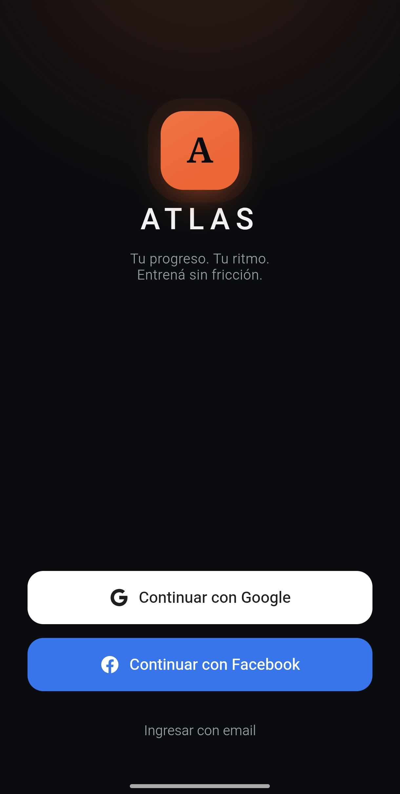
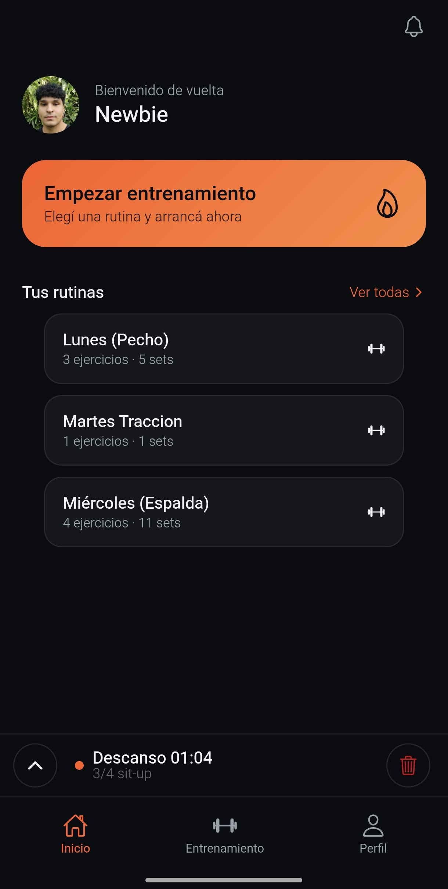
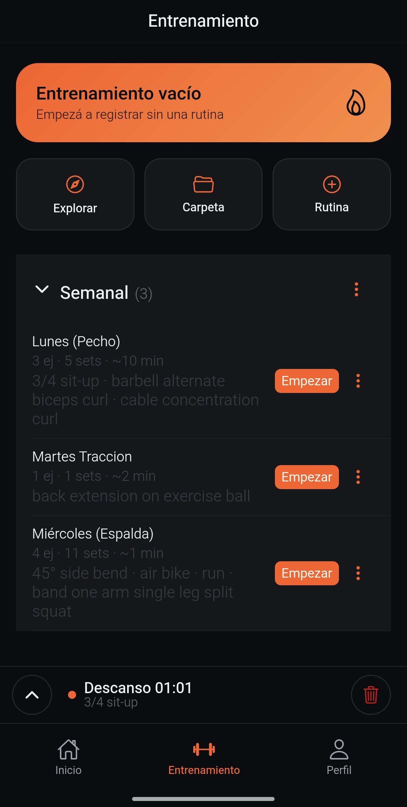
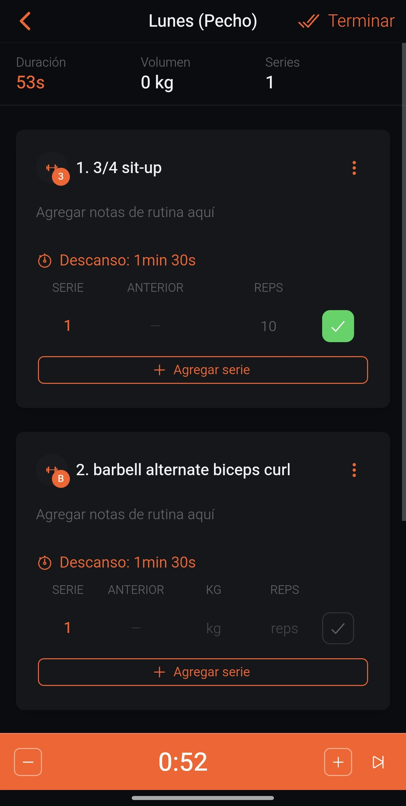
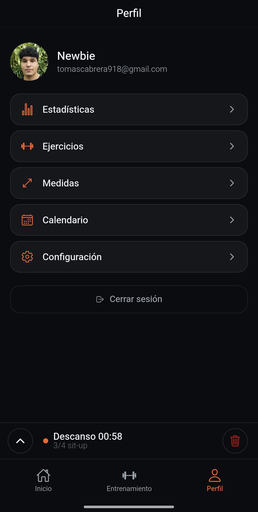

<div align="center">

# 🏔️ Atlas

**Un tracker de entrenamientos con look nativo, hecho sobre el módulo Gimnasio de [Proteus](https://github.com/Newbie1337x/Proteus-API) — rutinas, sesiones en vivo, récords personales.**

[](https://angular.dev)
[](https://ionicframework.com)
[](https://capacitorjs.com)
[](https://www.typescriptlang.org)
[](https://tanstack.com/query)

[🇬🇧 English](../README.md) · 🇪🇸 Español

</div>

---

<table>
<tr>
<td align="center" width="20%"><br/><sub><b>Login</b></sub></td>
<td align="center" width="20%"><br/><sub><b>Inicio</b></sub></td>
<td align="center" width="20%"><br/><sub><b>Rutinas</b></sub></td>
<td align="center" width="20%"><br/><sub><b>Sesión en vivo</b></sub></td>
<td align="center" width="20%"><br/><sub><b>Perfil</b></sub></td>
</tr>
</table>

## Qué es Atlas

Atlas es un tracker de entrenamientos mobile para el módulo Gimnasio (training) de [Proteus](https://github.com/Newbie1337x/Proteus-API) — rutinas organizadas en carpetas, sesiones de entrenamiento en vivo, récords personales, medidas corporales. Login social, offline-first, empaquetada como app instalable real vía Capacitor.

Es deliberadamente rígida: un shell fijo, un flujo fijo, sin personalización. Alguien entrenando quiere *siempre la misma pantalla*, en medio de una serie, sin tener que pensar — por eso cada pantalla existe para no estorbar mientras entrenás, no para configurarse.

## Qué funciona hoy

Esta lista está limitada a lo que está implementado y se puede probar ahora mismo, no al roadmap (ver [`EXECUTION-PLAN.md`](../EXECUTION-PLAN.md) para lo que sigue).

### Autenticación
- Login social primero — Google y Facebook en un toque, el orden de providers se adapta según la plataforma (`login.page.ts`)
- Email + contraseña como alternativa, escondido detrás de un link secundario para que nunca compita con el flujo de un toque
- Registro, verificación por email, olvidé/reseteo de contraseña — el circuito completo, incluyendo el par JWT `access` + `refresh` y refresh silencioso ante un 401
- URL base de la API resuelta en runtime (`app.config.ts`): abrís la app desde `localhost` y pega contra `localhost:8080`; la abrís desde una IP de LAN o Tailscale y pega contra *ese mismo host* en `:8080` — un solo build de desarrollo sirve a una notebook y a un celular a la vez, sin configuración

### Entrenamiento
- Rutinas organizadas en carpetas (o en el bucket suelto "Mis rutinas") — crear, renombrar, duplicar, borrar
- **Drag-and-drop con apretar y mantener** para reordenar rutinas o moverlas entre carpetas, con una secuencia real de dos pasos contra la API (primero el PATCH de carpeta de la rutina movida, después resecuenciar el `displayOrder` de ambas carpetas en una transacción cada una)
- Editor de rutinas completo: ejercicios, sets, descanso, notas, **supersets**, **modo de reps** (valor único o rango)
- Las capacidades de cada ejercicio manejan la UI, no al revés — un ejercicio de peso corporal nunca muestra el campo de peso, uno de duración nunca muestra reps; el backend aplica las mismas reglas al guardar, así que ningún cliente puede mandar una combinación inválida
- Tracker de entrenamiento en vivo: tildar sets, autocompleta los valores reales con el objetivo al primer toque, **cronómetro de descanso** con selector tipo rueda para ajustar ±15s rápido, **detección de PR en vivo** contra tu historial, **valores fantasma "ANTERIOR"** de tu última sesión de ese ejercicio
- **"Entrenamiento vacío"** ad-hoc — arrancás a trackear sin ninguna plantilla y vas agregando ejercicios sobre la marcha
- Fila de KPIs (tiempo transcurrido, volumen, series completadas) en vivo durante la sesión
- El entrenamiento sobrevive si navegás a otra pantalla — una mini-barra persistente en el shell te deja revisar rutinas o tu perfil a mitad de serie y volver directo
- Modos de carga por ejercicio: kilogramos o "bricks" (discos de peso fijo que apilás — útil para gimnasios en casa sin un juego completo de discos)
- Guards `CanDeactivate` en la sesión y en el editor de rutinas confirman antes de descartar cambios sin guardar

### Inicio / Perfil
- Dashboard de inicio: saludo, CTA de "empezar entrenamiento", tus propias rutinas como tarjetas de inicio rápido
- Perfil: estadísticas, historial de ejercicios, medidas corporales, calendario personal, configuración (gestión de providers vinculados, incluyendo desvincular)

### Transversal
- Banner de sin conexión (`NetworkService`) — la app sigue siendo completamente usable offline, las escrituras se encolan y sincronizan al volver la conexión
- Persistencia de TanStack Query — el cache de rutinas/sesión sobrevive un reinicio en frío de la app
- Empaquetada con Capacitor — es una app instalable real de iOS/Android (`npm run cap:ios` / `cap:android`), no solo una página web responsive

## Stack técnico

| Capa | Elección |
|---|---|
| Framework | Angular 22, componentes standalone, solo signals (nada de `BehaviorSubject` en código nuevo) |
| Shell mobile | Ionic 9 (`mode: 'ios'`) + Capacitor 8 — un solo código para iOS, Android y web |
| Estado de servidor | TanStack Query (basado en signals), con persistencia offline |
| Drag & drop | Angular CDK `DragDrop`, listas de drop conectadas entre carpetas |
| Estilos | Tema de variables CSS de Ionic hecho a mano — oscuro, un solo acento, sin UI kit |
| Cliente de API | `HttpClient` detrás de un único `ApiClient` + `AuthApi`, interceptor JWT con refresh, `HttpError` tipado en español |
| Nativo | `@capacitor/preferences`, `push-notifications`, `splash-screen`, `status-bar` |

## Cómo habla con Proteus

Atlas es un cliente puro del módulo `training` de [Proteus](https://github.com/Newbie1337x/Proteus-API) — cada request lleva un JWT (`userId`, `organizationId`, `role`) y un header `X-Tenant-Slug`, porque Proteus es multi-tenant y un mismo deploy puede alojar varias organizaciones a la vez. Algunos contratos que vale la pena destacar:

- **Escrituras de sesión idempotentes** — el cliente genera un UUID una sola vez al arrancar la sesión; cada `PUT /workouts/:uuid` durante el entrenamiento (tildar un set, ajustar el peso) es un reintento seguro después de una conexión caída o una pestaña cerrada, nunca un duplicado.
- **Capacidades calculadas por el servidor** — `ExerciseCapabilities` (qué campos acepta un ejercicio) vienen del backend, calculadas a partir del tipo de ejercicio + equipamiento, así el cliente nunca hardcodea "este ejercicio necesita peso".
- **Un fetch consolidado para arrancar una sesión** — `GET /workouts/prepare?routineId=` devuelve el detalle de la rutina, cada récord personal y los valores de la última sesión en un solo viaje en vez de tres.
- **Reorden en lote en una transacción** — `PATCH /routines/folder/:id/order` reescribe el `displayOrder` de cada rutina de la carpeta de forma atómica, que es lo que hace que el drag-and-drop se sienta instantáneo sin N requests secuenciales.

Ver [`PLAYBOOK.md`](../PLAYBOOK.md) para el contrato de auth completo (§4, verificado contra el código fuente de Proteus, no solo su documentación) y la estrategia offline (§7).

## Estructura del proyecto

```
src/app/
├── core/       # infraestructura transversal — auth, cliente de api, storage, manejo de errores
├── features/   # una carpeta por feature: auth, home, training, profile, shell, chat, notifications
└── shared/     # UI pura transversal (ahí vive el design system)
```

Cada feature tiene su propio `*.routes.ts`, se carga lazy, y no puede importar de una feature hermana — reforzado por lint, no por convención. Las reglas completas (límites de tamaño de archivo, la regla de solo-signals, por qué `HttpClient` está prohibido fuera de `ApiClient`) viven en [`ARCHITECTURE.md`](../ARCHITECTURE.md).

## Cómo arrancar

```bash
npm install
npm start          # ng serve --open, http://localhost:4200
```

Atlas necesita una instancia de [Proteus](https://github.com/Newbie1337x/Proteus-API) corriendo para todo lo que esté después del login. Por defecto apunta a `http://localhost:8080` — cambialo en `src/environments/environment.ts` si el tuyo corre en otro lado, o simplemente abrí la app desde otro host: el resolver de URL base en `app.config.ts` lo sigue automáticamente.

```bash
npm run build         # build de producción
npm run lint:all      # eslint + el script de límite de tamaño de archivo
npm run cap:ios       # sync + abrir en Xcode
npm run cap:android   # sync + abrir en Android Studio
```

## Más documentación

| Doc | Qué tiene |
|---|---|
| [`ARCHITECTURE.md`](../ARCHITECTURE.md) | Las reglas de ingeniería no negociables — layering reforzado por lint, límites de tamaño de archivo, la regla de solo-signals, y los anti-patrones que cada una previene |
| [`PLAYBOOK.md`](../PLAYBOOK.md) | El playbook técnico — contrato de auth con Proteus verificado, estrategia offline, convenciones del modelo de datos (supersets, valores fantasma, grupos musculares), razones del stack |
| [`EXECUTION-PLAN.md`](../EXECUTION-PLAN.md) | El roadmap completo por fases — reservas + check-in QR, membresías, vista de coach, HealthKit/Google Fit, chat en tiempo real, y más, fase por fase con definición de terminado |

## Lo que viene

Todavía no implementado, en seguimiento en [`EXECUTION-PLAN.md`](../EXECUTION-PLAN.md):

- Feed social (auto-posts de entrenamientos completados, likes/comentarios) — primero tiene que llegar el módulo `SOCIAL` del backend
- Chat — DMs en tiempo real sobre STOMP/WebSocket
- Reservas, check-in QR/GPS, membresías + pagos
- Vista de coach (toggle de doble rol)
- Sincronización con HealthKit / Google Fit

---

<div align="center">

Hecho por [Tomás Cabrera](https://github.com/Newbie1337x) · construido sobre [Proteus](https://github.com/Newbie1337x/Proteus-API)

</div>
